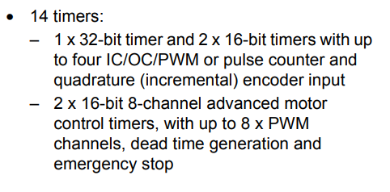

### Plan
1.  Use PA9 for counting impulses via External Interrupt (EXTI). (USART1 moved to PC4/PC5).
2.  Check available timers for PWM output and periodic velocity calculation.
    *   datasheet [link](https://www.st.com/resource/en/datasheet/stm32g431c6.pdf)
    *   image
        
3.  Controller Implementation:
    *   Count impulses using EXTI on PA9.
    *   Calculate velocity periodically (e.g., every 100ms using a timer interrupt or `HAL_GetTick()`).
    *   **Simulate the DC Motor:** Model and simulate offline (e.g., MATLAB/Simulink) to aid controller design and tuning.
    *   Design PI controller (Kp, Ki tuning needed).
    *   Implement direction control logic using configured GPIOs for the DRV8833 driver.
    *   Configure and use a Timer channel for PWM output to control motor speed via DRV8833.

### Gemini:
Implementing a PI controller using encoder pulses for feedback is a standard and effective way to achieve accurate motor speed control. Here's a breakdown of the steps involved and what you'll need to consider:

1.  **Encoder Input Configuration (PA9):**
    *   **External Interrupt (EXTI):** Configure PA9 as a GPIO Input with an EXTI line associated with it (e.g., EXTI9_5). You'll count pulses in the EXTI interrupt handler. This is suitable for single-pulse feedback.
    *   **CubeMX:** Configure the GPIO EXTI in CubeMX and regenerate the code.

2.  **Pulse Counting & Velocity Calculation:**
    *   **EXTI Handler (if using EXTI):**
        ```c
        // Add in USER CODE BEGIN PV
        volatile uint32_t encoderPulseCount = 0;

        // Add in USER CODE BEGIN 4 (or stm32xxxx_it.c)
        void HAL_GPIO_EXTI_Callback(uint16_t GPIO_Pin) {
            if (GPIO_Pin == GPIO_PIN_9) { // Check if it's PA9's interrupt
                encoderPulseCount++;
            }
        }
        ```
    *   **Velocity Calculation:** You need a periodic task (e.g., using another timer interrupt like Systick, or just in your main loop with `HAL_GetTick()`) to calculate velocity:
        ```c
        // Add in USER CODE BEGIN PV
        volatile float currentVelocity = 0.0f;
        volatile uint32_t lastPulseCount = 0;
        volatile uint32_t lastCalcTime = 0;
        #define CALCULATION_INTERVAL_MS 100 // Calculate velocity every 100ms
        #define PULSES_PER_REVOLUTION 1000 // Example: Encoder resolution
        // #define WHEEL_CIRCUMFERENCE_M 0.2 // Example: Wheel circumference in meters (If needed)

        // In your periodic task (e.g., main loop or timer ISR)
        uint32_t now = HAL_GetTick();
        if (now - lastCalcTime >= CALCULATION_INTERVAL_MS) {
            uint32_t currentPulseCount = encoderPulseCount; // Read volatile variable
            // Handle potential rollover if using a 32-bit counter for a long time, though unlikely here.
            uint32_t pulsesElapsed = currentPulseCount - lastPulseCount;
            float deltaTime_s = (now - lastCalcTime) / 1000.0f;

            // Prevent division by zero if deltaTime_s is too small or zero
            if (deltaTime_s > 0.0001f) { // Check against a small threshold
                 // Calculate velocity (e.g., Revolutions Per Second - RPS)
                float rps = (float)pulsesElapsed / PULSES_PER_REVOLUTION / deltaTime_s;
                currentVelocity = rps; // Store calculated velocity
            } else {
                // Handle case with no time elapsed or very short interval (e.g., maintain previous velocity or set to zero)
                // currentVelocity = 0.0f; // Or keep previous value
            }


            lastPulseCount = currentPulseCount;
            lastCalcTime = now;
            // Optional: printf("Pulses: %lu, Velocity (RPS): %.2f\n\r", pulsesElapsed, currentVelocity);
        }
        ```

3.  **PI Controller Implementation:**
    *   Modify your `regulator` function or create a new `updatePIController` function.
    *   ```c
        // Add in USER CODE BEGIN PV
        float Kp = 10.0f; // Proportional gain (NEEDS TUNING)
        float Ki = 5.0f;  // Integral gain (NEEDS TUNING)
        float integralTerm = 0.0f;
        // Determine PWM range based on Timer ARR value (e.g., 0 to ARR)
        // Example: If TIMx->ARR = 999, maxPWM is 999.0f
        float maxPWM = 999.0f; // Adjust based on selected Timer's ARR register value
        float minPWM = 0.0f;
        float maxIntegral = maxPWM / 2.0f; // Example anti-windup limit (NEEDS TUNING)

        // Modify regulator or create new function
        // Ensure this runs at the same frequency as velocity calculation (CALCULATION_INTERVAL_MS)
        void updatePIController(float desiredVelocity) {
            float error = desiredVelocity - currentVelocity; // Use the calculated velocity

            // Proportional Term
            float pTerm = Kp * error;

            // Integral Term with Anti-Windup
            integralTerm += Ki * error * (CALCULATION_INTERVAL_MS / 1000.0f);
            // Clamp integral term
            if (integralTerm > maxIntegral) integralTerm = maxIntegral;
            else if (integralTerm < -maxIntegral) integralTerm = -maxIntegral; // Use else if for clarity

            // Controller Output
            float output = pTerm + integralTerm;

            // Clamp output to PWM limits (Timer CCR value)
            if (output > maxPWM) output = maxPWM;
            else if (output < minPWM) output = minPWM; // Use else if

            // Update PWM Duty Cycle for the chosen Timer/Channel (e.g., TIM8 Ch2)
            // Replace TIM8->CCR2 with the correct register for your chosen timer/channel
            TIM8->CCR2 = (uint32_t)output; // Example: Assumes TIM8_CH2 is used

            // Optional: printf("Desired: %.2f, Current: %.2f, Error: %.2f, P: %.2f, I: %.2f, Output: %.0f\n\r",
            //       desiredVelocity, currentVelocity, error, pTerm, integralTerm, output);
        }
        ```

4.  **Integration:**
    *   Call `updatePIController(desiredVelocity)` periodically (matching `CALCULATION_INTERVAL_MS`) from your main loop or a dedicated timer interrupt, passing the desired velocity (e.g., received via I2C).
    *   Ensure the chosen PWM Timer channel is initialized (set ARR, prescaler) and the PWM output is started (`HAL_TIM_PWM_Start`).
    *   Implement functions to set motor direction using the DRV8833 control pins (e.g., `setMotorDirection(FORWARD)` or `setMotorDirection(BACKWARD)`).

**Summary:**

This refined approach uses EXTI for pulse counting and PI control for speed regulation via PWM, suitable for your hardware setup. Key steps are configuring EXTI, implementing periodic velocity calculation, tuning the PI controller, and correctly interfacing with the DRV8833 driver (PWM + Direction).

**Missing Pieces / Further Considerations:**

*   **Motor Driver Interface:** Confirm which specific Timer and Channel you will use for PWM output to the DRV8833. Ensure the Timer's ARR value is set appropriately and reflected in the `maxPWM` value in the PI controller. Ensure the GPIOs for direction are correctly controlled by your logic.
*   **Parameter Estimation:** While simulation is offline, you'll still likely need motor parameters (at least rough estimates like `PULSES_PER_REVOLUTION`) for the velocity calculation and potentially for initial PI tuning.
*   **PI Tuning Strategy:** Plan how you will tune Kp and Ki (e.g., start with simulation results, then refine on hardware).
*   **Communication Integration:** Ensure the I2C communication reliably provides the `desiredVelocity` to the control loop.
*   **Safety:** Consider adding safety features like stall detection (e.g., if pulses stop arriving but PWM is high) or an emergency stop mechanism.
*   **Units:** Maintain consistency in units (e.g., desired velocity vs. calculated velocity units like RPS).
*   **Timer for Velocity Calc:** Decide if you'll use `HAL_GetTick()` in the main loop or a dedicated hardware timer interrupt for the periodic velocity calculation and PI update. A hardware timer offers better timing precision.